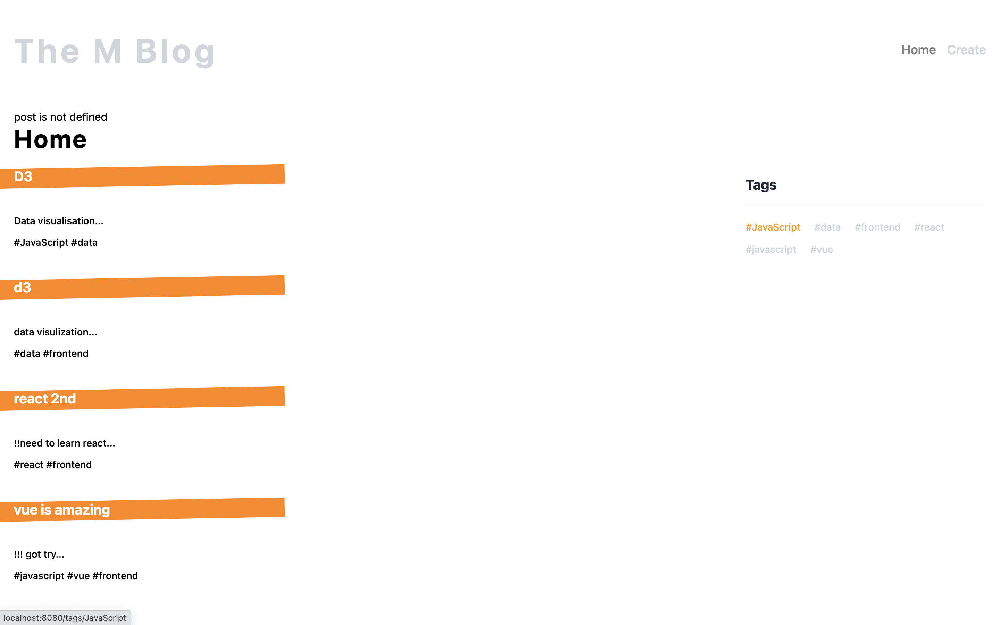
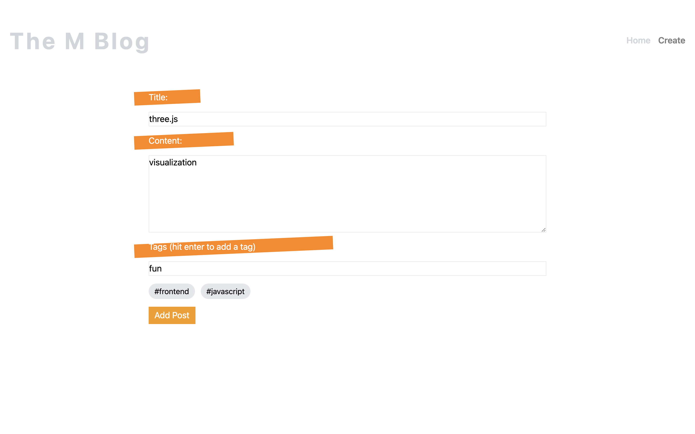

# blog-m
This is a web-blog created by Marshall

This web-app can lets user creat a post and see all the posts

## Technologies Used
- Generating using [Vue3] (https://v3.vuejs.org/)
- Using [Tailwindcss] for styling (https://tailwindcss.com/)
- [JavaScript] (https://developer.mozilla.org/en-US/docs/Web/JavaScript)
- [Firebase] for Database/Deployment (https://firebase.google.com/)

## Features
As a User:
- I can create a post, see all the posts,and click a tag to see the posts belongs to this tag (responsive view supported)

## Screenshot
Home:

Create:


## Setup
Online Visit(https://secret-blog.web.app/)

For Localhost

```
npm install
```

### Compiles and hot-reloads for development
```
npm run serve
```

## Structure

Virtual Dom Structure

Main entrance: ```src/App.vue```
               ```src/main.js```

Views are in the ```src/views ```
  - Home:  ```Home.vue```
  - Postdetails: ```Details.vue```
  - Tagpostslists: ```Tag.vue```
  - Create a post ```Create.vue```

Components in the ```src/components```
  - Navbar ```Navbar.vue```
  - PostList: ```PostList.vue```
  - SinglePost: ```SinglePost.vue```
  - Spinner:  ```Spinner.vue```
  - Tagcloud:  ```TagCloud.vue```
  
  Reusable JS code in the ```src/composables```
  
  router is in the ```src/router```
